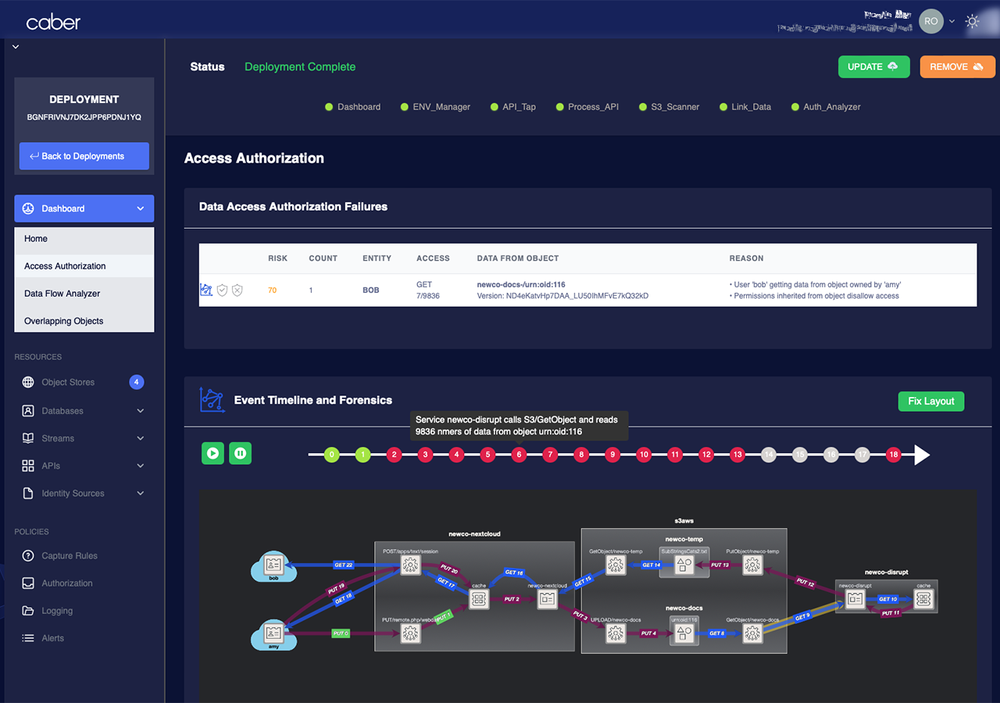

# Caber CA/CO: Continuous Authorization and Continuous Observability

Caber is addressing one of the toughest question in web application and API security: _How do we get rid of false positive alerts?_

Security tools today generate a lot of alerts, and most of them are false positives[^1]. True incidents of data breaches, such as those described in the OWASP Web Application Top10[^2] and API Security Top10[^3], are burried under thousands of these false positives and go unnoticed. 

Caber has drawn from scalable technologies across multiple disciplines to rearchitect to flip the web and API security model we have today.  Instead of alerting on every possible threat and being wrong most of the time, Caber detects real incidents deterministically so rights outweigh wrongs by orders of magnitude. 

## How it Works

False positives are a result of the probabalistic approach taken by today's security tools.  They hunt for anomalies when change is constant in modern cloud apps due to CI/CD.  Every new API is a new risk regardless of the data it may carry.  Policies that authorize access to data-in-transit and data-in-use are based upon API header and request parameters rather than on permissions associated with the data itself.  Because of growing application complexity, correlation between an anomaly, an API, or request paramters and true incidents where data confidentiality is compromised, is dwindling[^4].

Caber's Continuous Authorization and Continuous Observability platform, Caber CA/CO for short, is based on deterministic detection of incidents using an authorization-centric architecture that targets the most common vulnerabilities in modern cloud-based applications.

Caber CA/CO works by tracing bytes sequences in API payloads like packages on delivery trucks, then it connects them through API call graphs to their original objects and permissions.  

By combining these call-graphs, Caber CA/CO builds a model of application behavior that fuels AI-backed analysis of each incident and generation of remediation options such as policy updates, resource tagging, and configuration changes.  This analysis completes in minutes, versus today's Mean Time To Identify (MTTI) an incident of almost 7 months[^5]. 

## Key Features:
- **Authorize with Existing Permission**: Scalably track and authorize API payload access, using existing metadata and permissions in object stores, databases, and streaming sources.
- **Incident Identification**: Get an exact call graph for each incident, showing the path bytes took through the application with full detiails of the API calls and their parameters.
- **AI Analysis and Policy Generation**: Combining calls graphs with AI, Caber models application behavior giving it the abiity to pinpoint vulnerabilities, generate configuration updates, and policy changes that can be used to remediate incidents on existing controls.
- **Scalable Automated Deployment**: Caber deploys automatically into your AWS account and requires no agents or code changes. Only two observation points in the application, log ingest and a gateway plug-in, are required for it to work. 

## Demo Caber CA/CO
A self-service live demo of Caber CA/CO is available. Go to https://caber.com and click 'Try Demo' at the top.

You can also see video walkthrough of the demo at https://vimeo.com/923537694?share=copy

## Status

The core functionality of Caber CA/CO is complete.  However, the repo remains closed as we are still working on configuration, integrations, and reporting functionality.  

---
[^1]: [The False Positive Problem in Cybersecurity, CSO Online](https://www.csoonline.com/article/3513898/the-false-positive-problem-in-cybersecurity.html)

[^2]: [OWASP Top 10 - 2021](https://owasp.org/www-project-top-ten/)

[^3]: [OWASP API Security Top 10 - 2023](https://owasp.org/API-Security/editions/2023/en/0x00-header/)

[^4]: [Why API Attacks are Increasing and How to Avoid Them, CSO Online](https://www.csoonline.com/article/646557/why-api-attacks-are-increasing-and-how-to-avoid-them.html)

[^5]: [Cost of a Data Breach Report 2023, IBM](https://www.ibm.com/reports/data-breach)

